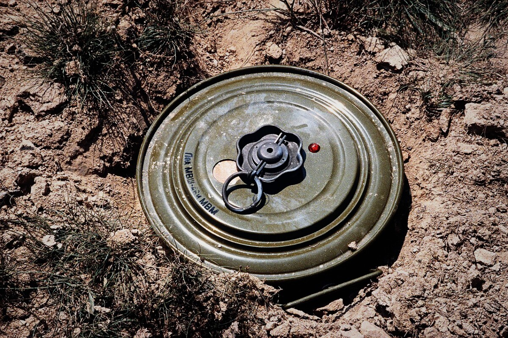
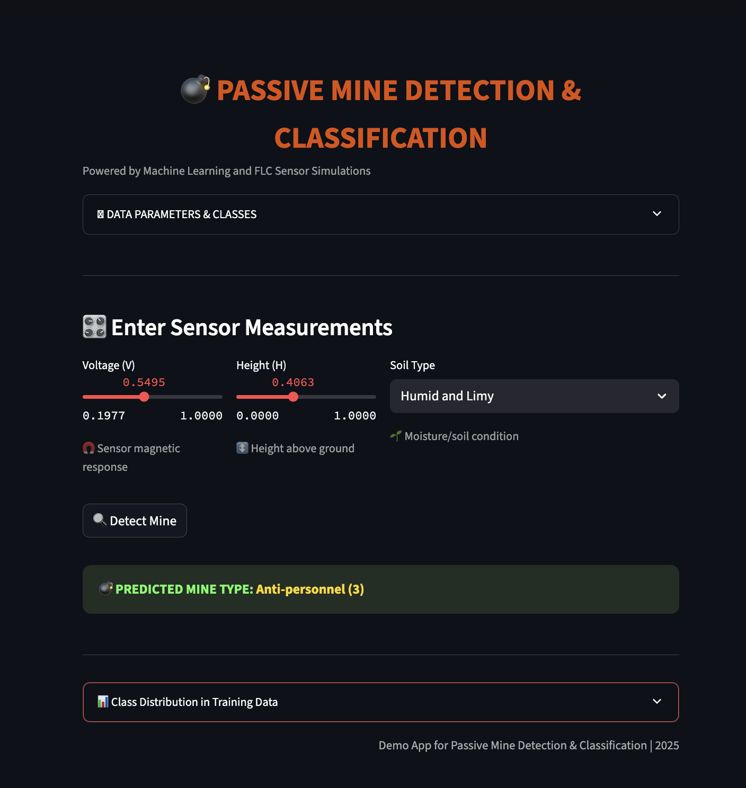
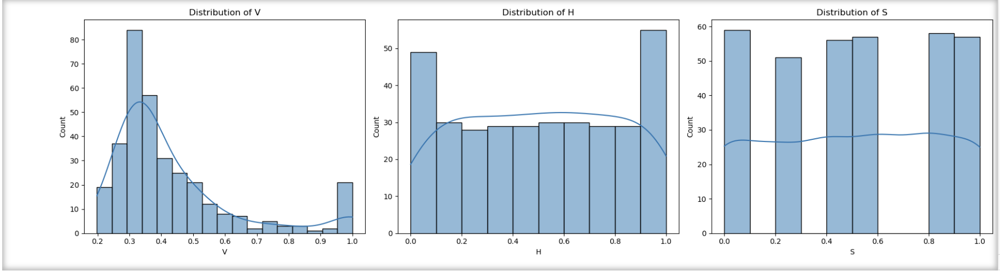

# 💣 Passive Mine Detection & Classification App

Detect and classify land mines with real-time sensor input using a machine learning web app.
This project uses **real FLC sensor data** (normalized), a Random Forest model, and an interactive Streamlit UI with a defense field aesthetic.

---

---

## 🚀 Features

- **Interactive demo:** Enter normalized sensor readings, pick soil type, and get instant mine-type predictions.
- **Professional UI:** Military-inspired dark theme, clear icons, expandable parameter cards, and field visuals.
- **Data-driven:** All parameter ranges and options inferred from real dataset (no hardcoded choices).
- **Interpretable:** See legends/mappings for soil and mine types, and explore class distribution in your data.
- **Visual EDA** panel for understanding sensor data distributions.
- **Portable:** Works with your own normalized CSV data, easy to train on updates.

---
### App UI

## 🗂️ Directory Structure

passive-mine-detection-app/
│

├── app.py
├── Mine_Dataset.csv

├── images/

│   ├── demo.jpeg 
│   └── distribution.jpeg       # Distribution plots for V, H, S

├── README.md

├── requirements.txt

└── LICENSE

---

## 📦 Getting Started

1. **Clone the repo:**
git clone https://github.com/yourusername/passive-mine-detection-app.git
cd passive-mine-detection-app

2. **Run the Streamlit app:**
streamlit run app.py

4. **Interact:**  
Start exploring mine detection by adjusting the sliders and dropdowns!

---

## 💾 Dataset Information

- **Mine_Dataset.csv** contains normalized readings for:
- Voltage (V): 0.1977 to 0.9999
- Height (H): 0.0 to 1.0
- Soil Type (S): Encoded as {0.0, 0.2, 0.4, 0.6, 0.8, 1.0}
- Mine Type (M): {1–5}
- See the app’s expandable info card for detailed parameter and class mappings.

---

## 🖼️ Visuals

### Feature Importance

### Feature Distributions

---

### 🙋‍♂️ Author
 Mohammed Yousuf
AI Engineering Student | Passionate about Machine Learning, Computer Vision, and Real-World Applications 🚀
Feel free to reach out or contribute!
### 📄 License
This project is licensed under the MIT License.
### 🌟 Star this repository
If you found this helpful, give it a ⭐ on GitHub!

